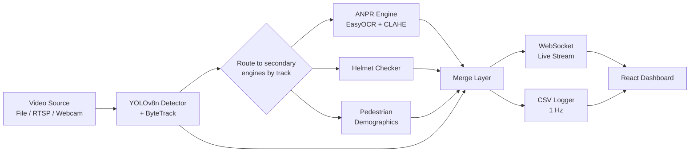

# IRIS — Indian Road Intelligence System


Real-time traffic video analysis for Indian roads: multi-class vehicle
detection & tracking, automatic number-plate recognition (ANPR),
two-wheeler helmet-compliance checking, and pedestrian demographic
classification — streamed live to a React dashboard and logged for
historical analytics.

Built end-to-end by a single developer: custom-trained YOLOv8 detectors,
a FastAPI + WebSocket backend, and a Vite/React dashboard. See
[MODEL_CARD.md](MODEL_CARD.md) and [LIMITATIONS.md](LIMITATIONS.md) for
an honest breakdown of what's validated and what isn't — this project
treats accuracy claims as development-stage indicators, not deployment
guarantees.

## Why this exists

Most off-the-shelf traffic-analytics models are trained on Western or
Chinese traffic and underperform on Indian road conditions: a high
proportion of two-wheelers and auto-rickshaws, dense/irregular lane
discipline, inconsistent plate formats, and inconsistent helmet
compliance. IRIS is a from-scratch attempt at a pipeline tuned for that
distribution — three custom-trained YOLOv8-Nano models (plate detector,
helmet classifier, pedestrian demographics classifier) integrated with
ByteTrack, EasyOCR, and hand-tuned business logic.

## Architecture



**Design choice worth calling out:** the three secondary engines (ANPR,
helmet, pedestrian) run in independent `ThreadPoolExecutor` pools rather
than inline in the detection loop. OCR and secondary classification are
far slower than detection — running them synchronously would collapse
frame rate. Decoupling them keeps the primary loop near real-time while
secondary results arrive a few frames later and are merged back in by
track ID.

## Tech stack

| Layer | Stack |
|---|---|
| Detection & tracking | Ultralytics YOLOv8-Nano, ByteTrack |
| ANPR | EasyOCR, OpenCV (CLAHE, bilateral filter, Otsu threshold) |
| Backend | FastAPI, Uvicorn, WebSockets, Python 3.12 |
| Frontend | React 18, Vite, Tailwind CSS, Recharts, Framer Motion |
| ML runtime | PyTorch (CUDA 12.4 on the reference dev machine; CPU-compatible) |

Full pinned versions: [`backend/requirements.txt`](backend/requirements.txt),
[`frontend/package.json`](frontend/package.json).

## Quickstart

### Option A — Docker (recommended)

```bash
git clone https://github.com/lohith400/Video-analysis.git
cd Video-analysis

# Trained weights are not committed to this repo (large binaries don't
# belong in git). Place your .pt files here before starting:
#   backend/models/license_plate_detector.pt
#   backend/models/helmet_detector.pt
#   backend/models/gender_detector.pt
# The pipeline runs without them too — plate/helmet/pedestrian detection
# just gets disabled with a warning, vehicle detection still works.

cp backend/.env.example backend/.env      # set IRIS_API_KEY if you want auth on
cp frontend/.env.example frontend/.env

docker compose up --build
```

- Dashboard: http://localhost:3000
- API: http://localhost:8000 (docs at `/docs`)

### Option B — Native (matches the original dev environment)

<details>
<summary>Expand for manual setup steps</summary>

**Backend**
```bash
cd backend
python3.12 -m venv .venv
source .venv/bin/activate   # Windows: .venv\Scripts\activate
pip install -r requirements.txt
cp .env.example .env
uvicorn server:app --host 0.0.0.0 --port 8000 --reload
```

**Frontend**
```bash
cd frontend
npm install
cp .env.example .env
npm run dev
```
</details>

## API

| Endpoint | Method | Auth | Description |
|---|---|---|---|
| `/health` | GET | none | CUDA device + server status |
| `/upload` | POST | API key* | Upload an MP4 for offline analysis |
| `/connect` | POST | API key* | Attach an RTSP URL or webcam index as a live source |
| `/stop` | POST | API key* | Stop the active stream, reset counters |
| `/analytics` | GET | none | Parsed historical data from the CSV log |
| `/video-feed` | WS | API key* | Live annotated frames + telemetry as JSON |

\* Auth is opt-in via `IRIS_API_KEY` (see `.env.example`). If unset, the
server runs open and prints a warning on startup — safe for local dev,
not for anything internet-facing.

## Testing

```bash
cd backend
pip install pytest
pytest test_traffic_counter.py test_plate_utils.py test_helmet_logic.py test_geometry_utils.py -v
```

These 36 tests cover the pure-logic pieces — line-crossing geometry,
class-vote smoothing, Indian plate regex/character-correction, the
rider/pillion positional heuristic, IoU, and the child-height heuristic —
without needing a GPU, a trained model, or even `torch`/`ultralytics`
installed. That's a deliberate split: see the module docstrings in
`plate_utils.py`, `helmet_logic.py`, and `geometry_utils.py` for why the
pure logic lives separately from the model-loading classes.

CI (`.github/workflows/ci.yml`) runs these on every push, plus a
frontend build check and a Docker image build check.

## Current status

Working prototype, functional end-to-end on recorded and live video,
verified against 18 real-world traffic clips. **Not yet production
validated** — see [LIMITATIONS.md](LIMITATIONS.md) for the honest
breakdown (small training datasets, heuristic-based rider/pillion and
child classification, no load testing, privacy considerations for
demographic data). [MODEL_CARD.md](MODEL_CARD.md) has the full dataset
composition and accuracy figures per model.

## License

MIT — see [LICENSE](LICENSE).
